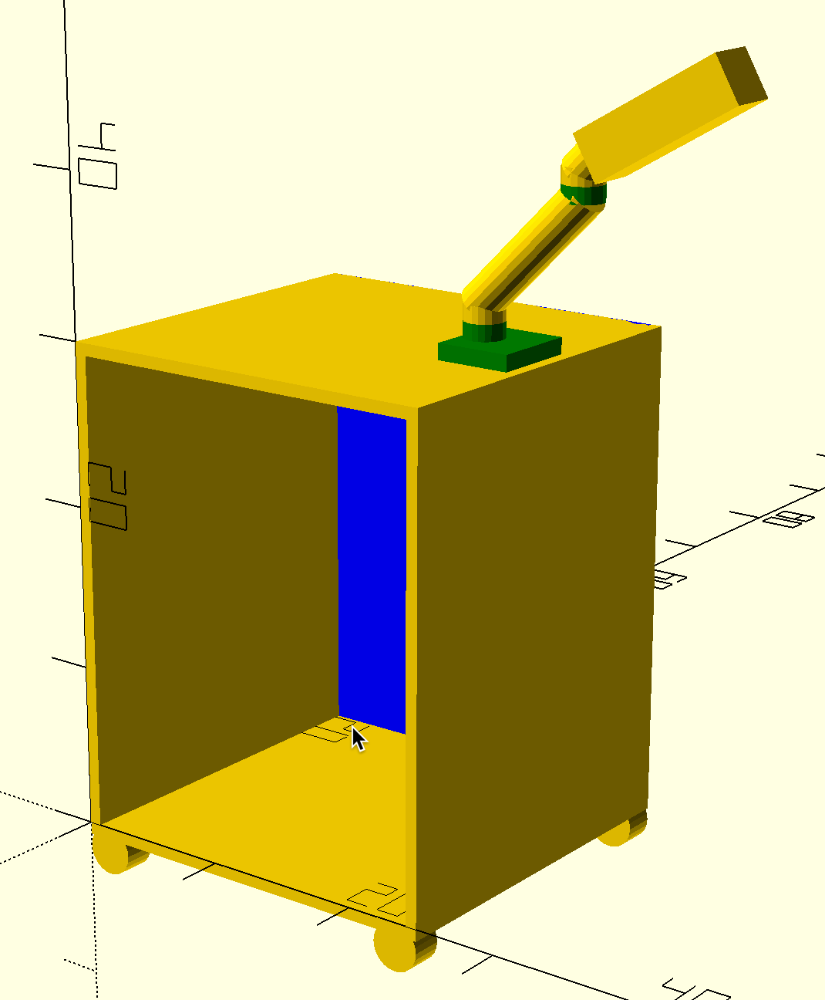
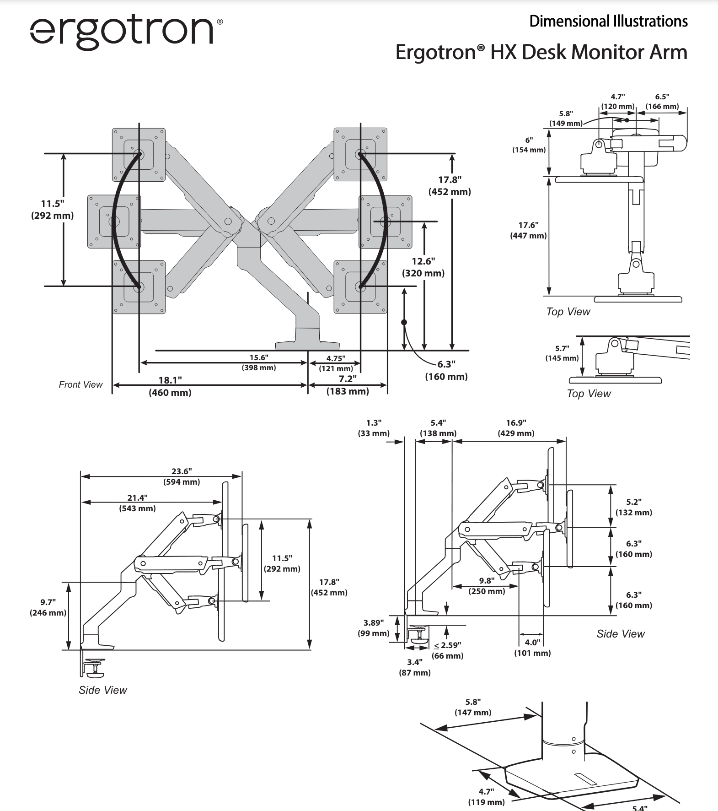

Mobile chairside cart with articulating arm
===

## Overview

This cart will sit alongside a HumanTouch ZG reclining chair and will hold a 40" 26lb monitor on an articulating arm.
The arm will be an [Ergotron HX Desk Monitor Arm](https://www.ergotron.com/en-us/products/product-details/45-475#/?color=black) spec'd to hold up to 40 lbs.  Because of the weight of the arm and monitor, the cantilever far out from the center of mass of the cart, the cart will need ~100lb of counterweight a the bottom.

The cart, including its castors, needs to be spec'd for something like 250lb of gross weight and will roll on a smooth hardwood floor.  A second cantilevered arm may be added to hold a keyboard or notebook computer. In this case, the counterweight may be ~150lb and the gross weight is 350lb.  

## Cart Dimensions and Construction

The cart's box is 24.75"W x 24"D x 30"H not including castors. These dimensions may change a bit but are not critical. It is thought that the device is made from 3/4" cabinet-grade ply with a hardwood veneer applied which is then stained and coated with a urethan or similar durable finish.  Something like 3" heavy-duty locking castors adds to the overall height.

The box is shown as a simple box construction but you have the latitude to improve on the design to add rigidity.

On the top surface is mounted the arm as shown below.  We might mount two arms, one for a monitor and a 2nd for a notebook/keyboard.

## Cart Additional Features

The cart shown above has an open front. But we might add shelves, or even a few drawers. Please quote it as follows:

1. Option-1:  Two fixed shelves
2. Option-2: Two pull-out drawers.   The bottom third needs to be reserved for the weights so the drawers will be above that.  

## Counter-Balance Calculation

As shown the Ergotron illustration below, the arm can cantilever out 23.6" beyond the base.  Give the 3D drawing above, that is approximately 23" beyond the castors.  There is a 26lb monitor at the end and the arm itself weighs 15lbs which is approximately like having 10lbs at the 23" extension.  So that is 36 lbs at 23".  A similar 2nd arm and a 10lb notebook at the end would add another 20lbs at 23" for a total of 56lbs.  To counter that, one would need at least 56lbs at the opposite side and since the opposite side is appprox 20" away (assuming a 24" cart with wheels inset a few inches.), We need at least 56 x (23/20) lbs all at the opposite edge.  In reality, even with lead weights, not all weight is at the 20" point and so more weight is needed.  I estimate 100 lbs which is mostly at the far end is enough.

Furthermore, the arm can swing to face the monitor at the front or at the rear of the cart. While this is not a likely use case, it is physically possible and so the cart would need to be weighted for these cases.  However, these cases place the 26lb monitor only approx 12" in front or behind the cart.   Doing the math, and adding a 2x safety factor, we need something like 30lbs near the front and 30 lbs near the rear ***TODO*** confirm. So that places 160lbs in the base.

## Ergotron HX Dimensions

